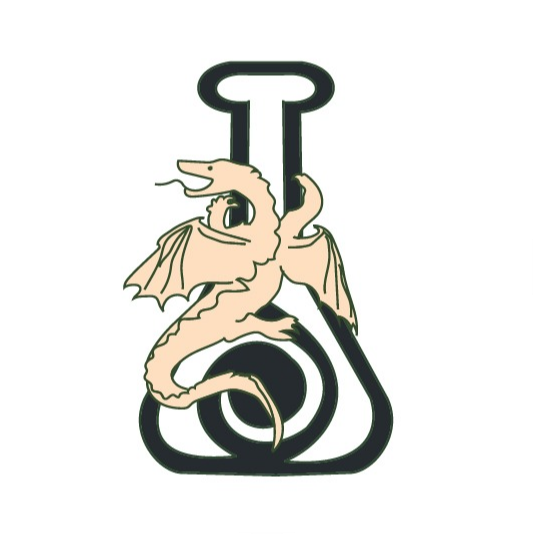

<p align="center"></p>
<h1 align="center">Skyrim:Alchenne</h1>

> <h5 align="center">Alchemy Information App (The Elder Scrolls V: Skyrim)</h5>

## About Alchenne

### Description:
|  |
| :---------------------------------: |
| image by <a href="https://www.nexusmods.com/skyrim/images/106594">begothprincess</a> |
| The Elder Scrolls V: Skyrim is an action role-playing video game developed by Bethesda Game Studios and published by Bethesda Softworks. The game provides multiple skills that the player can develop during gameplay. One of them is Alchemy, a skill that takes time to increase due to the constant search for specific ingredients and their possible effects. This is where Alchenne comes in, an application that serves as a source of information about potions, effects, ingredients and their locations. |

### Functionalities:
* Show all Alchemy ingredients.
* Show all Alchemy effects.
* Search bar for effects and ingredients.
* Favourites Tab for your favourites ingredients and effects.
* Potion Maker.

## Prototype:
> <a href="https://xd.adobe.com/view/67caac85-ab91-4460-4a20-c2973122c3d3-11fb/">Alchenne - MF</a>

## Screens:
|  |  |  | 
| :-----------------------------------: | :-----------------------------------: | :-----------------------------------: |
| **Favourites**                        | **Effects**                           | **Ingredients**                       |
|  |  |  |
| **Potion Maker**                      | **Effect's Info**                     | **Ingredient's Info**                 |

## Current Version:
> In development.

## Installation:
#### To run this project, you will need: 
1. Install the Flutter Framework following this steps: https://flutter.dev/
2. Clone the project to your editor of choice:
```sh
git clone https://github.com/Desannemada/WeeBooks.git
```
3. Connect your android phone or android emulator and run the command:
```sh
flutter run
```

## API:
Initially, Alchenne obtained it's information in real time by it's <a href="https://github.com/Desannemada/Alchenne/blob/master/pyAlchemy/main.py"> API </a>. Developed in Python and deployed in Heroku, it is divided into 4 parts. Two GET methods, one for obtaining all the ingredients and the other for the effects. And two POST methods, one for obtaining information for a specific effect and the other for a specific ingredient, both sending an URL through the method. Today, all this information is already stored in the application itself.

## Technologies Used:
|   |   |
| :----------------------: | :----------------------: |
| **Dart**                 | **Flutter**              |
| Programming Language     | Framework                |

## Sources:
> <a href="https://elderscrolls.fandom.com/wiki/Ingredients_(Skyrim)">Skyrim - The Elder Scrolls Wiki - Fandom</a>

> <a href="https://en.uesp.net/wiki/Skyrim:Alchemy_Effects">The Unofficial Elder Scrolls Pages (UESP)</a>

> <a href="https://skyrim.gamepedia.com/Category:Ingredient_images">Skyrim Wiki - Gamepedia</a>

> <a href="https://www.flickr.com/photos/106746736@N06/31136037851">Wallpaper1</a> by <a href="https://www.flickr.com/photos/106746736@N06/">D U B L</a>

> <a href="https://www.flickr.com/photos/106746736@N06/30350009903">Wallpaper2</a> by <a href="https://www.flickr.com/photos/106746736@N06/">D U B L</a>

> <a href="https://www.allwallpaper.in/the-elder-scrolls-v-skyrim-landscapes-multiscreen-panorama-wallpaper-15110.html">Wallpaper3</a> found on <a href="https://www.allwallpaper.in/">All Wallpaper</a>

> <a href="https://wallpapersafari.com/w/RLsk0M">Wallpaper4</a> found on <a href="https://wallpapersafari.com/">Wallpaper Safari</a>

> <a href="https://www.flickr.com/photos/106746736@N06/31561425935">Wallpaper5</a> by <a href="https://www.flickr.com/photos/106746736@N06/">D U B L</a>
